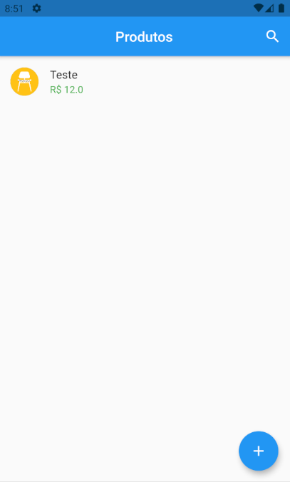
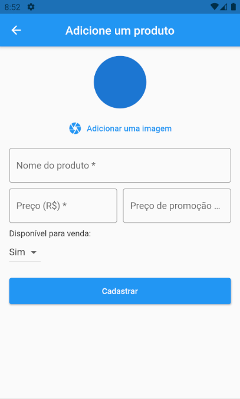
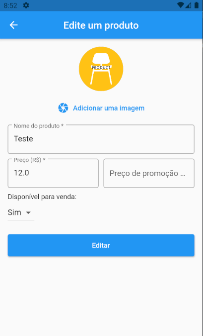

# <p align="center">Desafio Software Engineer, Mobile Developer - Confere</p>

 <p align="center">
 
 
 
 
 </p>

## Descrição
Product Manager é um aplicativo para gerenciamento de produtos.

## ✅ Plugins do Vscode

- Dart
- Dracula Oficial (tema, nao é obrigatorio esse, mas fica estiloso)
- Flutter
- Material Icon Theme
- Dart Data Class Generator
- Pubspec Assist

## ✅ Dependências do Projeto

- cupertino_icons: ^1.0.2
- flutter_modular: ^3.3.1
- flutter_bloc: ^7.0.1
- flutter_slidable: ^0.6.0
- google_fonts: ^2.1.0
- image_picker: ^0.8.2
- lint: ^1.5.3
- path_provider: ^2.0.2
- rflutter_alert: ^2.0.2
- sqflite: ^2.0.0+3
- uuid: ^3.0.4
- bloc: ^7.0.0
- rxdart: ^0.27.1

## ✅ Telas

- 
- 
- 

## ✅  Instalação

Necessário:

- [Flutter](https://flutter.dev) 2.2.3 ou superior
- Visual Studio Code ou Android Studio
- Git
- ❌ Não é necessário instalar Android SDK nem AVD. A partir do Flutter 2.0.6 existe a versão "Chrome" ou "Edge"

Instalação

```
$ git clone https://github.com/DawidOliveira/desafio-software-engineer-mobile-confere.git
cd desafio-software-engineer-mobile-confere
code . 
```

Após abrir o Visual Studio Code, execute:
```
$ flutter pub get
```
aperte F5 para compilar e executar o projeto.

Enjoy!
